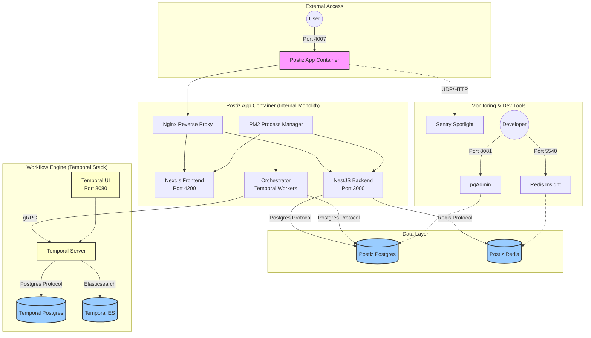

# Docker Architecture - Postiz

This document provides a visualization and detailed explanation of the Docker setup for the Postiz project. The project uses a multi-container architecture orchestrated via Docker Compose, separating the application logic, databases, and workflow engine.

## Service Visualization

The following diagram illustrates how the services interact within the Docker environment.



---

## Service Descriptions

### 1. Main Application (`postiz`)
This is the core container that bundles the frontend, backend, and orchestrator.
- **Image**: `ghcr.io/gitroomhq/postiz-app:latest`
- **Internal Components**:
    - **Nginx**: Acts as the entry point, routing requests to the frontend or the `/api` backend.
    - **NestJS Backend**: The main API server.
    - **Next.js Frontend**: The web interface.
    - **Orchestrator**: Temporal workers that handle background jobs (social media posting, scheduling).
- **Process Management**: Uses **PM2** to keep all three Node.js services running concurrently.

### 2. Databases & Caching
- **Postiz Postgres** (`postiz-postgres`): The primary relational database for user data, posts, and configurations.
- **Postiz Redis** (`postiz-redis`): Used for session management, response caching, and internal task queuing.

### 3. Workflow Engine (Temporal Stack)
Postiz leverages **Temporal** for reliable, long-running background tasks (like retrying failed social media posts).
- **Temporal Server**: The core orchestrator for workflows and activities.
- **Temporal Postgres**: dedicated database for Temporal internal state.
- **Temporal Elasticsearch**: Provides advanced search and visibility for workflows.
- **Temporal UI**: A dashboard to monitor and debug workflows (accessible at `http://localhost:8080`).

### 4. Development & Monitoring Tools
- **Spotlight**: A Sentry tool for local debugging of errors and performance.
- **pgAdmin**: Web-based PostgreSQL administration interface.
- **Redis Insight**: Visualization tool for Redis data.

---

## Networking

The architecture uses two primary Docker networks:

1.  **`postiz-network`**: Connects the main application with its primary database (`postiz-postgres`) and cache (`postiz-redis`).
2.  **`temporal-network`**: A dedicated network for the Temporal stack to communicate internally and with the `postiz` app's orchestrator.

## Configuration (Environment Variables)

The services are configured heavily via environment variables in the `docker-compose.yaml`. Key variables include:
- `MAIN_URL`: The public-facing URL.
- `DATABASE_URL`: Connection string for the primary Postgres.
- `REDIS_URL`: Connection string for Redis.
- `TEMPORAL_ADDRESS`: The address where the app can find the Temporal server (`temporal:7233`).

---

## How to Run

### Production-like (bundled)
```bash
docker compose up -d
```

### Development (Infrastructure only)
If you are developing locally and want to run the app via `pnpm run dev` but keep the databases in Docker:
```bash
docker compose -f docker-compose.dev.yaml up -d
```
