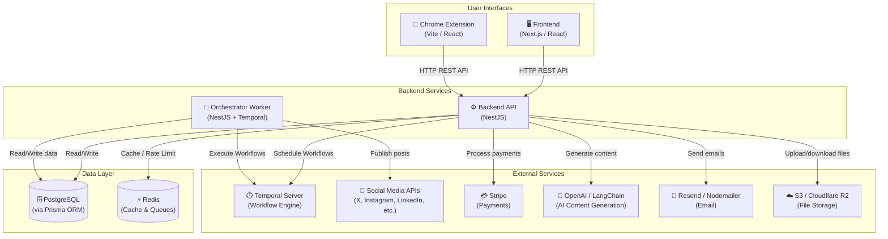
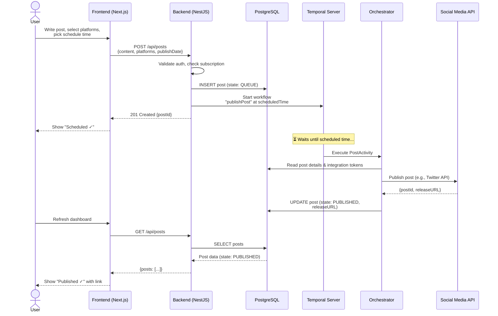
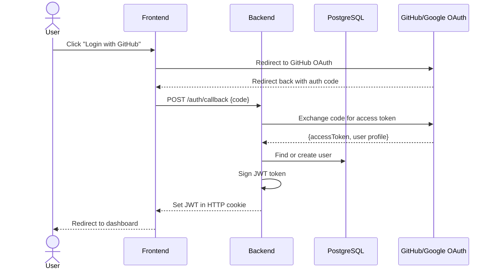
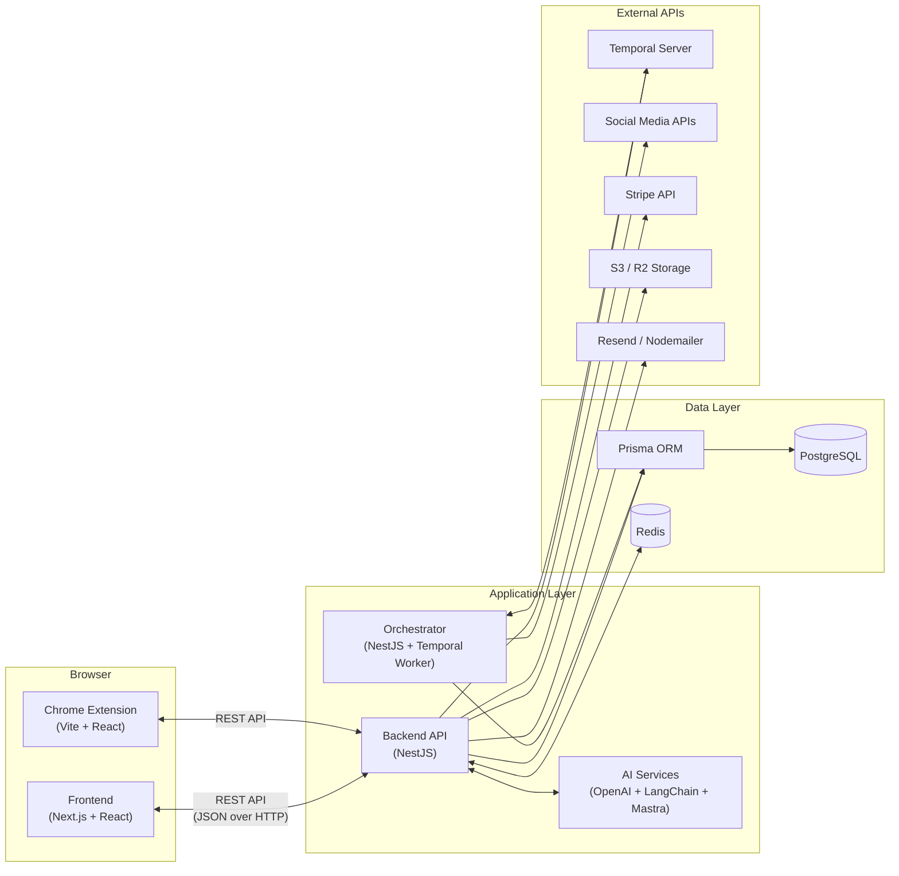

# Postiz — Comprehensive Learning Guide

> **Goal**: Understand the full structure, technologies, and architecture of the Postiz codebase.

---

## Table of Contents

1. [High-Level Overview](#1-high-level-overview)
2. [Technology Stack Breakdown](#2-technology-stack-breakdown)
3. [Repository Structure Analysis](#3-repository-structure-analysis)
4. [File-Level Technology Mapping](#4-file-level-technology-mapping)
5. [Technology Concepts I Need to Learn](#5-technology-concepts-i-need-to-learn)
6. [How Everything Connects Together](#6-how-everything-connects-together)
7. [Interconnection of Technologies](#7-interconnection-of-technologies)
8. [Beginner Learning Roadmap](#8-beginner-learning-roadmap)
9. [Summary](#9-summary)

---

## 1. High-Level Overview

### What This Project Does

**Postiz** is an open-source **AI-powered social media scheduling tool**. Think of it as a self-hostable alternative to tools like Buffer, Hootsuite, or Hypefury. It lets you:

- **Schedule posts** to 20+ social media platforms (X/Twitter, Instagram, Facebook, LinkedIn, TikTok, YouTube, Reddit, Discord, Slack, Mastodon, Bluesky, and more).
- **Use AI** to generate, improve, and auto-create post content.
- **View analytics** to measure the performance of your posts.
- **Collaborate with teams** — invite members, assign roles, leave comments on drafts.
- **Automate posting** via RSS feeds, webhooks, and a public API.
- **Manage billing** with Stripe-powered subscriptions.

### What Problem It Solves

Managing social media across many platforms is time-consuming. Postiz lets users write a post once, schedule it to multiple platforms simultaneously, and track its performance — all from one dashboard.

### Major Components

| Component         | Role                                                         |
|--------------------|--------------------------------------------------------------|
| **Frontend**       | The web UI users interact with (dashboard, post editor, analytics) |
| **Backend (API)**  | Handles all business logic, authentication, data storage     |
| **Orchestrator**   | A background worker that schedules and publishes posts at the right time |
| **Database**       | PostgreSQL — stores all user data, posts, integrations      |
| **Cache / Queue**  | Redis — caching, rate-limiting, Temporal queue storage       |
| **Temporal**       | A workflow engine that manages timed jobs (post scheduling, token refresh) |
| **Extension**      | A Chrome browser extension for quick posting                 |

### System Architecture



---

## 2. Technology Stack Breakdown

### Frontend Technologies

| Technology | Why It's Used | Where in Codebase |
|---|---|---|
| **React 18** | The core UI library — builds the interactive dashboard as composable "components" | `apps/frontend/src/components/` |
| **Next.js 14** | A React framework that adds routing, server-side rendering, and API routes | `apps/frontend/` (App Router: `src/app/`) |
| **TypeScript** | Adds type safety to JavaScript — catches bugs before they run | All `.ts` and `.tsx` files everywhere |
| **Tailwind CSS** | Utility-first CSS framework — style elements with classes like `bg-blue-500 text-white` | `apps/frontend/tailwind.config.js`, `global.scss` |
| **TipTap** | A rich-text editor framework — powers the post content editor | `@tiptap/*` packages in `package.json` |
| **Uppy** | File upload library — handles drag-and-drop image/video uploads | `@uppy/*` packages, `components/media/` |
| **SWR** | Data-fetching library — efficiently loads and caches API data in the browser | `swr` in `package.json` |
| **CopilotKit** | AI copilot UI components — provides the AI assistant interface | `@copilotkit/*`, `copilot.controller.ts` |
| **Zustand** | Lightweight state management — shares state between React components | `zustand` in `package.json` |
| **Chart.js** | Chart library — renders analytics graphs | `chart.js` in `package.json`, `components/analytics/` |
| **SCSS** | Enhanced CSS syntax with variables and nesting | `global.scss`, `colors.scss` |
| **i18next** | Internationalization — supports multiple languages | `react-i18next`, `i18n.json` |

### Backend Technologies

| Technology | Why It's Used | Where in Codebase |
|---|---|---|
| **Node.js** | JavaScript runtime — runs JavaScript outside the browser, on the server | The entire backend runs on Node.js |
| **NestJS** | An opinionated backend framework — organizes code into modules, controllers, and services (like Spring Boot for Java or Django for Python) | `apps/backend/`, `apps/orchestrator/` |
| **Prisma** | ORM (Object-Relational Mapper) — lets you interact with the database using TypeScript objects instead of raw SQL | `libraries/nestjs-libraries/src/database/prisma/` |
| **PostgreSQL** | Relational database — stores all persistent data (users, posts, integrations) | `schema.prisma`, Docker Compose |
| **Redis** | In-memory data store — used for caching, rate limiting, and as a message broker | `libraries/nestjs-libraries/src/redis/` |
| **Temporal** | Workflow engine — manages scheduled tasks like post publishing, token refresh, streak tracking | `apps/orchestrator/`, `libraries/nestjs-libraries/src/temporal/` |
| **Swagger** | Auto-generates API documentation from code annotations | `@nestjs/swagger`, `loadSwagger()` in `main.ts` |

### AI & Content Technologies

| Technology | Why It's Used | Where in Codebase |
|---|---|---|
| **OpenAI** | GPT models — generates post content, suggests improvements | `libraries/nestjs-libraries/src/openai/` |
| **LangChain** | AI orchestration — chains multiple AI operations together | `@langchain/*` packages |
| **Mastra** | AI agent framework — powers the AI agent feature with memory and tools | `libraries/nestjs-libraries/src/agent/` |
| **CopilotKit** | Frontend AI assistant — the chat-like UI for AI features | `@copilotkit/*` packages |

### Infrastructure & DevOps

| Technology | Why It's Used | Where in Codebase |
|---|---|---|
| **Docker** | Containerization — packages the entire app into portable containers | `docker-compose.yaml`, `Dockerfile.dev` |
| **pnpm workspaces** | Monorepo package manager — manages multiple sub-projects in one repository | `pnpm-workspace.yaml`, root `package.json` |
| **Sentry** | Error monitoring — captures and reports runtime errors | `@sentry/nestjs`, `@sentry/nextjs` |
| **Stripe** | Payment processing — handles subscriptions and billing | `stripe` package, `stripe.service.ts`, `billing.controller.ts` |
| **Resend / Nodemailer** | Email delivery — sends login codes, digest emails, notifications | `libraries/nestjs-libraries/src/emails/` |
| **AWS S3 / Cloudflare R2** | Cloud file storage — stores uploaded images and videos | `@aws-sdk/*`, `libraries/nestjs-libraries/src/upload/` |

### Browser Extension

| Technology | Why It's Used | Where in Codebase |
|---|---|---|
| **Vite** | Fast build tool — bundles the Chrome extension code | `apps/extension/vite.config.ts` |
| **CRXJS** | Chrome extension Vite plugin — enables hot-reload during development | `@crxjs/vite-plugin` |

---

## 3. Repository Structure Analysis

### Top-Level Overview

```
postiz-app/
├── apps/                    # Application code (each app is a separate deployable unit)
│   ├── frontend/            # Next.js web application (the user dashboard)
│   ├── backend/             # NestJS API server (all business logic)
│   ├── orchestrator/        # Temporal worker (background job processing)
│   ├── extension/           # Chrome browser extension
│   ├── cli/                 # Command-line interface tool
│   ├── sdk/                 # Node.js SDK for the public API
│   └── commands/            # NestJS CLI commands for admin tasks
├── libraries/               # Shared code libraries used by multiple apps
│   ├── nestjs-libraries/    # Shared NestJS code (database, integrations, services)
│   ├── react-shared-libraries/ # Shared React components (forms, helpers, toasters)
│   └── helpers/             # Pure utility functions (no framework dependency)
├── docker-compose.yaml      # Production Docker setup
├── docker-compose.dev.yaml  # Development Docker setup (DB + Redis only)
├── package.json             # Root package with all dependencies and scripts
├── pnpm-workspace.yaml      # Monorepo workspace configuration
└── tsconfig.base.json       # Shared TypeScript configuration
```

### Detailed Folder Breakdown

---

#### `apps/frontend/` — The Web Dashboard

**Technology**: Next.js 14 (App Router) + React 18 + Tailwind CSS

This is what users see and interact with in their browser.

```
apps/frontend/
├── src/
│   ├── app/                           # Next.js App Router (file-based routing)
│   │   ├── (app)/                     # Route group for the main application
│   │   │   ├── (site)/                # Authenticated dashboard pages
│   │   │   │   ├── launches/          # Post scheduling & calendar view
│   │   │   │   ├── analytics/         # Analytics & charts
│   │   │   │   ├── billing/           # Subscription management
│   │   │   │   ├── settings/          # User & org settings
│   │   │   │   ├── media/             # Media library
│   │   │   │   ├── agents/            # AI agent interface
│   │   │   │   └── ...
│   │   │   ├── auth/                  # Login, register, forgot password pages
│   │   │   ├── integrations/          # Social media platform connection flow
│   │   │   └── layout.tsx             # Root app layout (fonts, providers, analytics)
│   │   └── (extension)/               # Pages embedded in the Chrome extension
│   ├── components/                    # Reusable UI components
│   │   ├── launches/                  # Post creation/editing components
│   │   ├── analytics/                 # Chart & metric components
│   │   ├── auth/                      # Login/register forms
│   │   ├── billing/                   # Payment UI
│   │   ├── media/                     # File upload & gallery
│   │   ├── layout/                    # Navigation, sidebar, header
│   │   ├── settings/                  # Settings panels
│   │   ├── preview/                   # Social media post preview
│   │   └── ui/                        # Generic UI components (buttons, modals)
│   ├── middleware.ts                   # Next.js middleware (auth redirects, i18n)
│   └── global.scss                    # Global styles
├── tailwind.config.js                  # Tailwind CSS configuration
├── next.config.js                      # Next.js configuration
└── package.json                        # Frontend-specific dependencies & scripts
```

---

#### `apps/backend/` — The API Server

**Technology**: NestJS + TypeScript

This is the brain of the application. It handles all HTTP requests, business logic, authentication, and orchestrates communication with the database and external services.

```
apps/backend/
├── src/
│   ├── main.ts                        # Application entry point (creates NestJS app, sets up CORS, Swagger, MCP)
│   ├── app.module.ts                  # Root module — imports all other modules
│   ├── api/
│   │   ├── api.module.ts              # Registers all controllers & services
│   │   └── routes/                    # API endpoint controllers (one per feature)
│   │       ├── auth.controller.ts     # Login, register, password reset
│   │       ├── posts.controller.ts    # Create, update, delete, schedule posts
│   │       ├── integrations.controller.ts # Connect/disconnect social accounts
│   │       ├── media.controller.ts    # Upload, list, delete media files
│   │       ├── analytics.controller.ts # Fetch analytics data
│   │       ├── billing.controller.ts  # Stripe subscription management
│   │       ├── users.controller.ts    # User profile, team management
│   │       ├── copilot.controller.ts  # AI copilot endpoint
│   │       ├── settings.controller.ts # Organization settings
│   │       ├── stripe.controller.ts   # Stripe webhook handler
│   │       ├── webhooks.controller.ts # Outgoing webhook management
│   │       └── ... (24 controller files total)
│   ├── services/
│   │   └── auth/                      # Authentication logic, JWT handling, permissions
│   ├── public-api/                    # Public API endpoints (for SDK/external access)
│   └── assets/                        # Static assets
└── package.json
```

---

#### `apps/orchestrator/` — The Background Worker

**Technology**: NestJS + Temporal

This service runs in the background and executes scheduled tasks. It does NOT handle HTTP requests — it only processes Temporal workflows.

```
apps/orchestrator/
├── src/
│   ├── main.ts                        # Boots a NestJS context (no HTTP server)
│   ├── app.module.ts                  # Imports Temporal module and activities
│   ├── workflows/                     # Temporal workflow definitions
│   │   ├── post-workflows/
│   │   │   └── post.workflow.v1.0.1.ts  # Main post publishing workflow
│   │   ├── autopost.workflow.ts       # Automated posting from RSS feeds
│   │   ├── refresh.token.workflow.ts  # Refreshes expired OAuth tokens
│   │   ├── send.email.workflow.ts     # Sends notification emails
│   │   ├── digest.email.workflow.ts   # Sends daily digest emails
│   │   ├── streak.workflow.ts         # Tracks posting streaks
│   │   └── missing.post.workflow.ts   # Handles missing/failed posts
│   ├── activities/                    # Temporal activity implementations (actual work)
│   │   ├── post.activity.ts           # Publishes posts to social media APIs
│   │   ├── email.activity.ts          # Sends emails via Resend/Nodemailer
│   │   ├── integrations.activity.ts   # Refreshes integration tokens
│   │   └── autopost.activity.ts       # Fetches RSS content for auto-posting
│   └── signals/                       # Temporal signals (inter-workflow communication)
└── package.json
```

---

#### `libraries/nestjs-libraries/` — Shared Backend Code

This is the largest code directory. It contains all domain logic shared between the backend and orchestrator.

```
libraries/nestjs-libraries/src/
├── database/prisma/
│   ├── schema.prisma                  # DATABASE SCHEMA — defines all tables & relations
│   ├── prisma.service.ts              # Prisma client connection
│   ├── database.module.ts             # NestJS module that exports all repositories
│   ├── posts/                         # Post CRUD operations (repository pattern)
│   ├── integrations/                  # Integration CRUD
│   ├── users/                         # User CRUD
│   ├── organizations/                 # Organization CRUD
│   ├── media/                         # Media file CRUD
│   ├── notifications/                 # Notification CRUD
│   ├── subscriptions/                 # Subscription/billing data
│   └── ... (14 domain-specific subdirectories)
├── integrations/
│   ├── integration.manager.ts         # Routes requests to the correct social media provider
│   ├── social/
│   │   ├── social.integrations.interface.ts  # Interface that ALL providers implement
│   │   ├── x.provider.ts             # X (Twitter) integration
│   │   ├── instagram.provider.ts     # Instagram integration
│   │   ├── facebook.provider.ts      # Facebook integration
│   │   ├── linkedin.provider.ts      # LinkedIn integration
│   │   ├── tiktok.provider.ts        # TikTok integration
│   │   ├── youtube.provider.ts       # YouTube integration
│   │   ├── reddit.provider.ts        # Reddit integration
│   │   ├── discord.provider.ts       # Discord integration
│   │   ├── bluesky.provider.ts       # Bluesky integration
│   │   ├── mastodon.provider.ts      # Mastodon integration
│   │   └── ... (36 provider files total)
│   └── social.abstract.ts            # Base class with shared provider logic
├── openai/
│   ├── openai.service.ts              # OpenAI API wrapper for content generation
│   └── extract.content.service.ts     # Extracts content from URLs for AI
├── agent/
│   ├── agent.graph.service.ts         # LangChain/Mastra AI agent logic
│   └── agent.module.ts               # NestJS module for AI agents
├── redis/                             # Redis connection & helper services
├── services/
│   ├── stripe.service.ts              # Stripe payment processing (subscriptions, invoices)
│   └── email.service.ts               # Email sending via Resend/Nodemailer
├── upload/                            # File upload to S3/Cloudflare R2/local disk
├── temporal/                          # Temporal client configuration & workflow registration
├── emails/                            # Email templates
├── short-linking/                     # URL shortening (Dub, Kutt, etc.)
├── chat/                              # MCP (Model Context Protocol) server
├── throttler/                         # Rate limiting configuration
├── sentry/                            # Error monitoring setup
└── track/                             # Analytics tracking
```

---

#### `libraries/react-shared-libraries/` — Shared Frontend Code

```
libraries/react-shared-libraries/src/
├── form/           # Shared form components (inputs, selectors)
├── helpers/        # Utility hooks, context providers, PostHog analytics
├── toaster/        # Toast notification system
├── sentry/         # Sentry error boundary for React
└── translation/    # i18next translation configuration
```

---

#### `libraries/helpers/` — Pure Utility Functions

Framework-agnostic helper functions used by both frontend and backend.

---

#### `apps/extension/` — Chrome Extension

**Technology**: Vite + React + CRXJS

A browser extension that lets users quickly create posts without opening the full dashboard.

---

#### `apps/cli/` & `apps/sdk/` — External Tools

- **CLI**: Command-line tool for interacting with Postiz.
- **SDK**: JavaScript/TypeScript SDK published to npm (`@postiz/node`) for programmatic access to the public API.

---

## 4. File-Level Technology Mapping

### Key Files Explained

| File Path | Technology | What It Does | Key Concepts |
|---|---|---|---|
| `apps/frontend/src/app/(app)/layout.tsx` | Next.js + React | Root layout — loads fonts, wraps app in providers (Sentry, PostHog, CopilotKit, i18n) | Server Components, Layouts, Context Providers |
| `apps/frontend/src/middleware.ts` | Next.js | Intercepts requests before rendering — handles auth redirects & language detection | Middleware, Request/Response rewriting |
| `apps/frontend/src/components/launches/` | React + TipTap + Uppy | Post creation components — rich text editor, media upload, scheduling calendar | Client Components, Hooks, Rich Text Editing |
| `apps/backend/src/main.ts` | NestJS | Entry point — creates the HTTP server, sets up CORS, Swagger docs, cookie parsing, compression, MCP | Application Bootstrap, Middleware |
| `apps/backend/src/app.module.ts` | NestJS | Root module — imports all sub-modules (Database, API, Agent, Chat, Temporal, Throttler) | Module Composition, Dependency Injection |
| `apps/backend/src/api/api.module.ts` | NestJS | Registers 24 controllers and their services, applies auth middleware to protected routes | Module setup, Middleware Consumer |
| `apps/backend/src/api/routes/posts.controller.ts` | NestJS | API endpoints for creating, updating, deleting, and scheduling posts | Controllers, Decorators, DTOs |
| `apps/backend/src/api/routes/auth.controller.ts` | NestJS | Login, registration, forgot password, OAuth callback handling | Authentication, JWT, Guards |
| `apps/backend/src/api/routes/integrations.controller.ts` | NestJS | Connect/disconnect social media accounts, manage OAuth flows | OAuth 2.0, Integration Management |
| `libraries/nestjs-libraries/src/database/prisma/schema.prisma` | Prisma | Defines 30+ database tables, their columns, relationships, and indexes | Schema Definition, Relations, Indexing |
| `libraries/nestjs-libraries/src/database/prisma/database.module.ts` | NestJS + Prisma | NestJS module that exposes all repository services for database access | Module Exports, Repository Pattern |
| `libraries/nestjs-libraries/src/integrations/social/social.integrations.interface.ts` | TypeScript | Interface that every social media provider must implement (`post()`, `authenticate()`, `refreshToken()`, `analytics()`) | Interfaces, Polymorphism, Strategy Pattern |
| `libraries/nestjs-libraries/src/integrations/social/x.provider.ts` | TypeScript + twitter-api-v2 | X/Twitter integration — authenticates, posts tweets, fetches analytics | OAuth 2.0, REST API, Provider Pattern |
| `libraries/nestjs-libraries/src/integrations/integration.manager.ts` | NestJS | Routes requests to the correct social media provider based on `providerIdentifier` | Factory Pattern, Dynamic Dispatch |
| `libraries/nestjs-libraries/src/openai/openai.service.ts` | OpenAI SDK | Generates AI post content, suggests improvements, creates image descriptions | API Integration, Prompt Engineering |
| `libraries/nestjs-libraries/src/agent/agent.graph.service.ts` | LangChain + Mastra | AI agent that can research topics, generate content, and manage posting workflows | AI Agents, Graph-based Workflows |
| `libraries/nestjs-libraries/src/services/stripe.service.ts` | Stripe SDK | Handles subscription creation, invoice management, webhook processing | Payment Processing, Webhooks |
| `apps/orchestrator/src/workflows/post-workflows/post.workflow.v1.0.1.ts` | Temporal | Defines the post publishing workflow — waits until scheduled time, then triggers publishing | Temporal Workflows, Timers, Signals |
| `apps/orchestrator/src/activities/post.activity.ts` | NestJS + Temporal | Actual logic for publishing a post — calls the correct social media provider | Temporal Activities, Error Handling |
| `docker-compose.yaml` | Docker Compose | Defines all services: Postiz app, PostgreSQL, Redis, Temporal (+ its Elasticsearch & PostgreSQL), and monitoring | Container Orchestration, Networking |

---

## 5. Technology Concepts I Need to Learn

### TypeScript
- Type annotations (`string`, `number`, `boolean`)
- Interfaces and type aliases
- Generics (`Promise<T>`, `Array<T>`)
- Enums
- Decorators (`@Module()`, `@Controller()`, `@Injectable()`)
- Async/await for asynchronous operations

### React
- **Components**: Functions that return UI (HTML-like JSX)
- **Props**: Data passed from parent to child components
- **State** (`useState`): Data that changes over time and triggers re-renders
- **Effects** (`useEffect`): Running code when component mounts or data changes
- **Context**: Sharing data globally without passing props through every level
- **Custom hooks**: Reusable logic extracted into functions (e.g., `useFetch`)

### Next.js (App Router)
- **File-based routing**: Each folder in `app/` becomes a URL route
- **Route groups**: Folders with `(parentheses)` group routes without creating URL segments
- **Layouts**: Shared UI that wraps multiple pages (`layout.tsx`)
- **Server Components**: Components that run on the server (default in App Router)
- **Client Components**: Components that run in the browser (`'use client'` directive)
- **Middleware**: Code that runs before every request (`middleware.ts`)
- **API routes**: Backend endpoints co-located with frontend code

### NestJS
- **Modules** (`@Module`): Containers that group related controllers and services
- **Controllers** (`@Controller`): Handle incoming HTTP requests and return responses
- **Services** (`@Injectable`): Contain business logic, injected into controllers
- **Dependency Injection**: NestJS automatically creates and provides service instances
- **Guards**: Protect routes (e.g., check if user is authenticated)
- **Middleware**: Process requests before they reach controllers
- **Decorators**: Annotations that add metadata (`@Get()`, `@Post()`, `@Body()`)

### Prisma
- **Schema**: A file (`schema.prisma`) that defines your database tables and relationships
- **Models**: Each `model` becomes a database table
- **Relations**: `@relation` links between tables (one-to-many, many-to-many)
- **Client**: Auto-generated TypeScript API for reading/writing data
- **Migrations**: `prisma db push` syncs the schema to the actual database

### PostgreSQL
- Tables, rows, and columns
- Primary keys (`@id`) and foreign keys
- Indexes (`@@index`) for query performance
- Unique constraints (`@@unique`)

### Redis
- Key-value caching (store frequently-accessed data in memory)
- Rate limiting (throttle API requests per user)
- Pub/Sub messaging

### Temporal
- **Workflows**: Durable functions that survive server restarts (e.g., "publish this post at 3 PM tomorrow")
- **Activities**: The actual work called by workflows (e.g., "call the Twitter API")
- **Signals**: Messages sent to running workflows
- **Schedules**: Cron-like recurring workflow execution

### Docker
- **Images**: Blueprints for creating containers
- **Containers**: Running instances of images
- **Docker Compose**: Define and run multi-container applications
- **Volumes**: Persistent data storage
- **Networks**: Communication channels between containers

### pnpm Workspaces (Monorepo)
- A single repository that contains multiple related projects
- Shared `node_modules` and dependency management
- Cross-project imports using workspace aliases (`@gitroom/frontend`, `@gitroom/backend`)

---

## 6. How Everything Connects Together

### Full Data Flow — Scheduling a Post

Here's what happens when a user creates and schedules a social media post:

1. **User writes a post** in the frontend's rich text editor (TipTap)
2. **User selects platforms** (e.g., X + LinkedIn) and a scheduled time
3. **Frontend sends POST request** to `backend/api/posts`
4. **Backend validates** the request (auth check, input validation, subscription limits)
5. **Backend saves the post** to PostgreSQL via Prisma
6. **Backend triggers a Temporal workflow** — "publish this post at {scheduled time}"
7. **Temporal holds the workflow** until the scheduled time arrives
8. **Orchestrator picks up the workflow** and executes the `PostActivity`
9. **PostActivity calls the correct social media provider** (e.g., `x.provider.ts`)
10. **Provider sends the post** to the social media API (e.g., Twitter API v2)
11. **Result is stored** back in PostgreSQL (post ID, release URL, status)
12. **User sees "Published"** status in the frontend dashboard

### Sequence Diagram



### Authentication Flow



---

## 7. Interconnection of Technologies

### Component Interaction Diagram



### How Technologies Interact

| Connection | How They Talk | What They Exchange |
|---|---|---|
| **Frontend ↔ Backend** | HTTP REST API calls (JSON). Frontend uses `fetch` / `SWR` to call backend endpoints. Cookies carry JWT auth tokens. | Post data, user info, analytics, file upload URLs |
| **Backend ↔ PostgreSQL** | Prisma Client generates SQL queries from TypeScript method calls (e.g., `prisma.post.findMany()`) | All persistent data (users, posts, integrations, subscriptions) |
| **Backend ↔ Redis** | `ioredis` client library. Used by the rate limiter (`@nestjs/throttler`) and for caching | Rate limit counters, cached data, session state |
| **Backend → Temporal** | Temporal Client SDK starts workflows with parameters | Workflow IDs, post group IDs, scheduled times |
| **Orchestrator ↔ Temporal** | Temporal Worker SDK polls for tasks and executes activities | Workflow task assignments, activity results |
| **Orchestrator → Social APIs** | Each provider calls the platform's REST API using `axios`, official SDKs, or custom HTTP clients | OAuth tokens, post content, media files, analytics data |
| **Backend → Stripe** | Stripe SDK makes API calls for subscriptions, customer management, and webhook verification | Subscription data, payment intents, invoices |
| **Backend → S3/R2** | AWS SDK generates pre-signed upload URLs; files are uploaded directly from the browser | Upload URLs, file metadata, storage paths |
| **Backend → OpenAI** | OpenAI SDK sends prompts and receives AI-generated content | Prompts, completions, content suggestions |

---

## 8. Beginner Learning Roadmap

Follow this step-by-step order to build up the knowledge needed to understand the entire Postiz codebase:

### Phase 1 — Language Foundations (Week 1–2)

| Step | Topic | Why | Resources |
|---|---|---|---|
| 1 | **JavaScript fundamentals** | The language everything in this project is written in. You already know C++ and Python — JS will feel familiar but has quirks (async, closures, prototypes). | [javascript.info](https://javascript.info) |
| 2 | **TypeScript** | Adds types to JavaScript. Every file in Postiz is `.ts` or `.tsx`. Learn type annotations, interfaces, generics, and enums. | [TypeScript Handbook](https://www.typescriptlang.org/docs/handbook/) |

### Phase 2 — Frontend (Week 3–5)

| Step | Topic | Why | Resources |
|---|---|---|---|
| 3 | **HTML & CSS basics** | The building blocks of web pages. Learn selectors, flexbox, grid. | [MDN Web Docs](https://developer.mozilla.org/en-US/docs/Learn) |
| 4 | **React** | The UI library. Learn components, props, state, hooks, event handling. Build a small app. | [react.dev](https://react.dev/learn) |
| 5 | **Next.js (App Router)** | The framework Postiz uses for the frontend. Learn routing, layouts, server/client components. | [nextjs.org/learn](https://nextjs.org/learn) |
| 6 | **Tailwind CSS** | The styling approach used in Postiz. Learn utility classes, responsive design, dark mode. | [tailwindcss.com/docs](https://tailwindcss.com/docs) |

### Phase 3 — Backend (Week 6–8)

| Step | Topic | Why | Resources |
|---|---|---|---|
| 7 | **Node.js** | The server runtime. Learn how JavaScript runs on the server, npm/pnpm, the event loop. | [nodejs.org/en/learn](https://nodejs.org/en/learn) |
| 8 | **NestJS** | The backend framework. Learn modules, controllers, services, dependency injection. Build a small CRUD API. | [docs.nestjs.com](https://docs.nestjs.com) |
| 9 | **REST API concepts** | How frontend and backend communicate. Learn HTTP methods (GET, POST, PUT, DELETE), status codes, JSON. | [restfulapi.net](https://restfulapi.net) |

### Phase 4 — Data Layer (Week 9–10)

| Step | Topic | Why | Resources |
|---|---|---|---|
| 10 | **SQL & PostgreSQL** | The database. Learn tables, relations, queries (SELECT, INSERT, JOIN), indexes. | [sqlbolt.com](https://sqlbolt.com) |
| 11 | **Prisma** | The ORM that replaces raw SQL. Learn schema definition, migrations, the Prisma Client API. | [prisma.io/docs](https://www.prisma.io/docs) |
| 12 | **Redis** | In-memory data store. Learn basic commands (GET, SET, EXPIRE), caching patterns. | [redis.io/learn](https://redis.io/learn) |

### Phase 5 — Infrastructure (Week 11–12)

| Step | Topic | Why | Resources |
|---|---|---|---|
| 13 | **Docker** | Containerization. Learn images, containers, Dockerfiles, docker-compose. | [docs.docker.com/get-started](https://docs.docker.com/get-started/) |
| 14 | **Temporal** | Workflow engine. Understand durable execution, workflows vs activities, schedules. | [docs.temporal.io](https://docs.temporal.io) |
| 15 | **OAuth 2.0** | Authentication protocol used to connect social media accounts. | [oauth.net/2](https://oauth.net/2/) |

### Phase 6 — Advanced Topics (Week 13+)

| Step | Topic | Why |
|---|---|---|
| 16 | **Monorepo patterns** (pnpm workspaces) | Understand how the project structure works |
| 17 | **Stripe** (Payment integration) | Understand the billing system |
| 18 | **AI integration** (OpenAI, LangChain) | Understand the AI features |
| 19 | **MCP** (Model Context Protocol) | Understand the AI agent infrastructure |

---

## 9. Summary

### Key Technologies Used

| Layer | Technologies |
|---|---|
| **Frontend** | React 18, Next.js 14 (App Router), TypeScript, Tailwind CSS, TipTap, Uppy, SWR, Zustand, CopilotKit |
| **Backend** | Node.js, NestJS, TypeScript, Prisma, Swagger |
| **Database** | PostgreSQL (primary), Redis (cache + rate limiting) |
| **Task Queue** | Temporal (durable workflow execution) |
| **AI** | OpenAI, LangChain, Mastra, CopilotKit |
| **Payments** | Stripe |
| **Infrastructure** | Docker, pnpm workspaces, Sentry, Resend |
| **Integrations** | 36 social media providers (X, Instagram, Facebook, LinkedIn, TikTok, YouTube, Reddit, Discord, etc.) |

### Core Architecture Pattern

Postiz follows a **monorepo microservice architecture**:

- **Monorepo**: All code lives in one repository, organized by `apps/` (deployable services) and `libraries/` (shared code).
- **Three-service split**: Frontend (UI) → Backend (API) → Orchestrator (Workers).
- **Provider Pattern**: Each social media platform implements the same `SocialProvider` interface, making it easy to add new platforms.
- **Event-driven scheduling**: The backend doesn't publish posts directly. It schedules Temporal workflows that the orchestrator executes at the right time.

### Most Important Concepts to Master

1. **TypeScript** — the language of the entire codebase
2. **React components + hooks** — how the UI is built
3. **Next.js App Router** — how pages and routes work
4. **NestJS modules/controllers/services** — how the backend is organized
5. **Prisma schema + client** — how data is modeled and accessed
6. **Temporal workflows + activities** — how background jobs work
7. **OAuth 2.0** — how social media connections are established
8. **The Provider/Strategy pattern** — how 36 integrations share one interface
9. **Docker Compose** — how the entire stack runs together
10. **Monorepo structure** — how code is shared between apps
